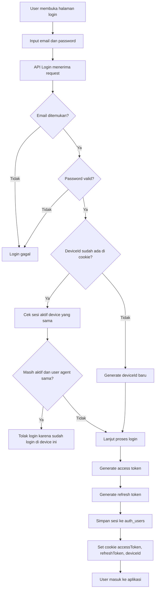
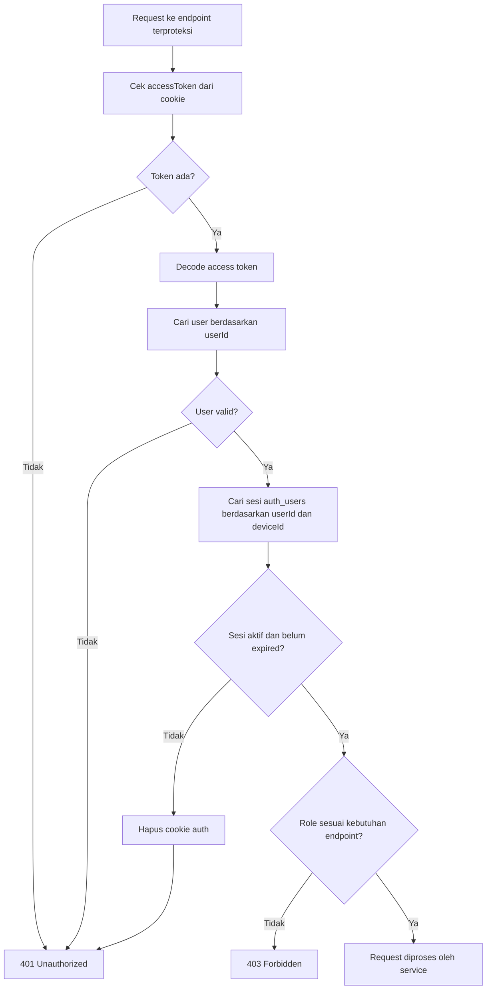
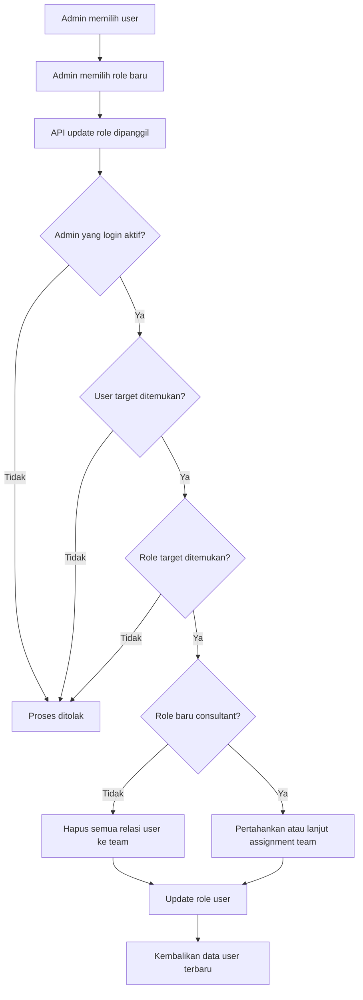
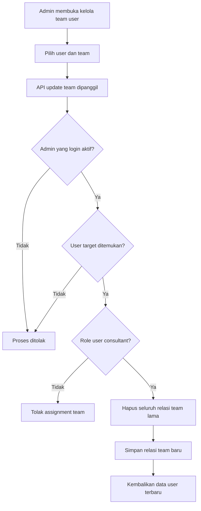
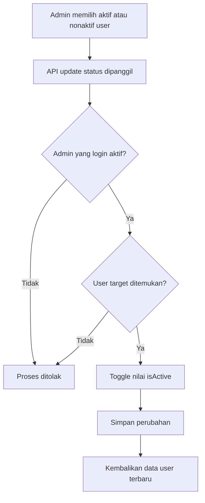
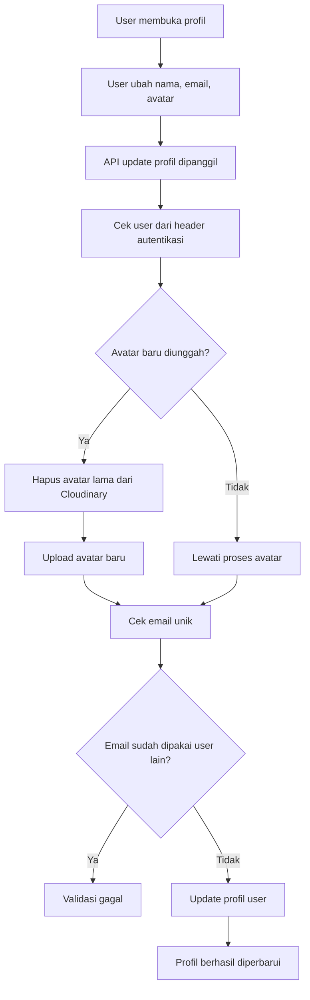
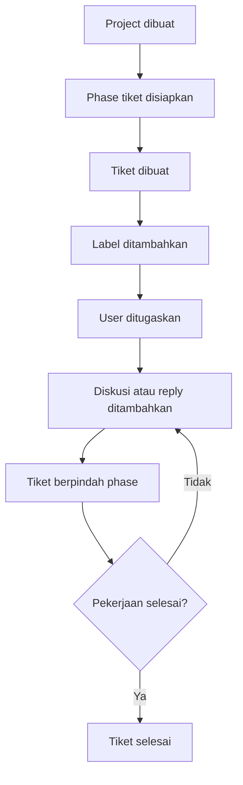
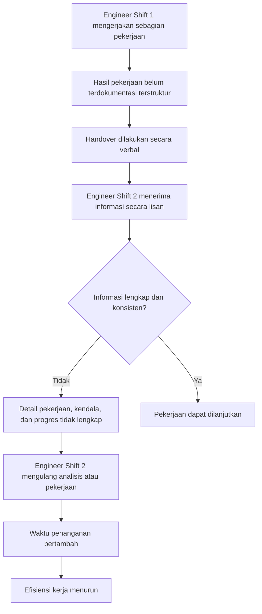
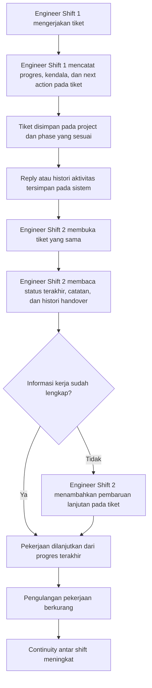

# Diagram Flow Proses Bisnis

Dokumen ini memvisualisasikan alur proses bisnis utama yang berhasil diidentifikasi dari implementasi aplikasi.

## 1. Flow Login dan Validasi Sesi

## 2. Flow Otorisasi Endpoint

## 3. Flow Admin Mengubah Role User

## 4. Flow Admin Mengelola Team User

## 5. Flow Admin Mengubah Status User

## 6. Flow Update Profil

## 7. Flow Konseptual Ticketing

Diagram ini bersifat konseptual karena model database ticketing sudah tersedia, tetapi API operasional tiket belum ditemukan.

## 8. Flow Existing Handover Manual

Bagian ini menggambarkan kondisi bisnis sebelum menggunakan aplikasi ticketing, ketika proses handover antar shift masih mengandalkan komunikasi verbal.

## 9. Flow Solusi Menggunakan Aplikasi Ticketing

Bagian ini menggambarkan kondisi bisnis setelah proses handover dibantu aplikasi ticketing sehingga informasi kerja tercatat dan dapat ditelusuri antar shift.

