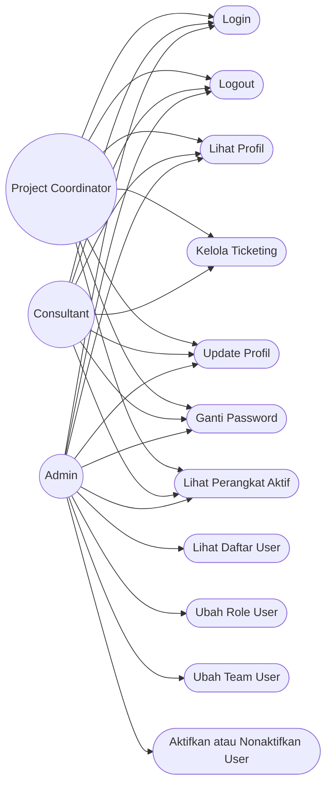
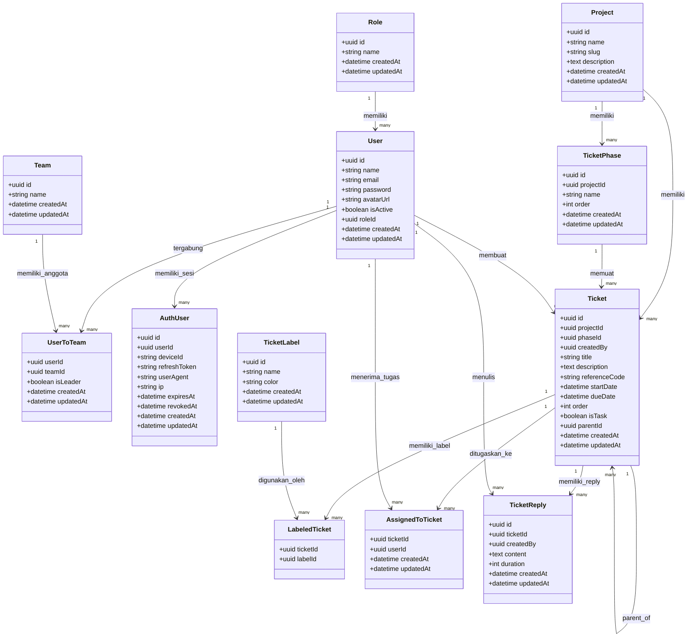
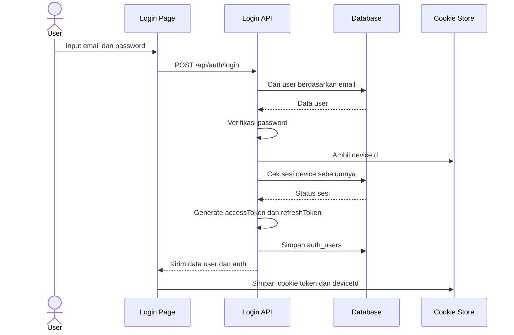
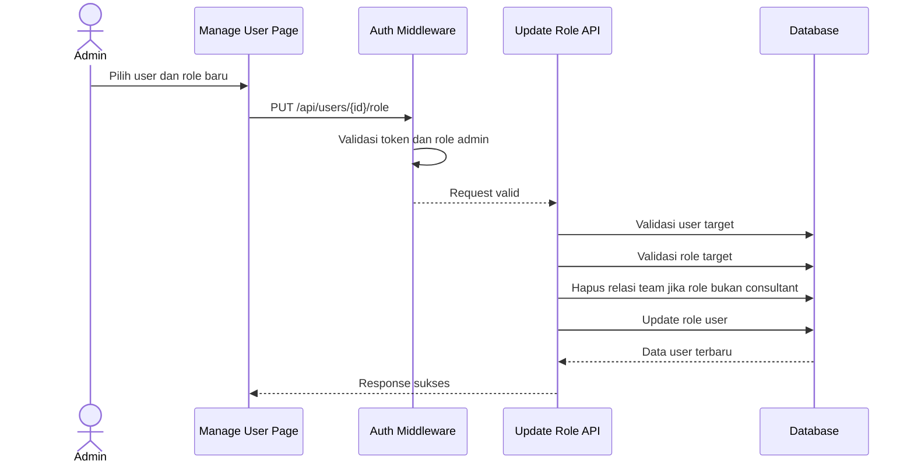
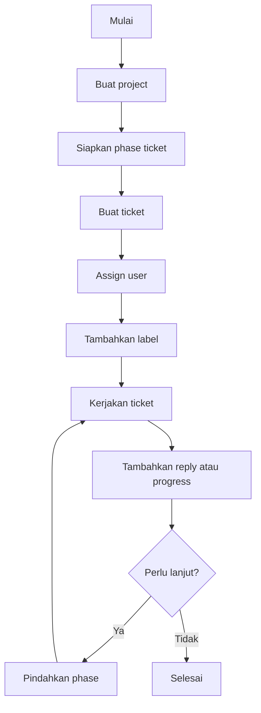

# UML Aplikasi Ticketing

Dokumen ini menyajikan UML utama berdasarkan implementasi yang ada saat ini.

## 1. Use Case Diagram

Catatan:

- `Kelola Ticketing` masih diposisikan sebagai use case konseptual karena domain data sudah ada, tetapi endpoint operasionalnya belum terlihat pada implementasi API aktif.

## 2. Class Diagram

## 3. Sequence Diagram Login

## 4. Sequence Diagram Admin Mengubah Role User

## 5. Activity Diagram Konseptual Ticket Lifecycle

